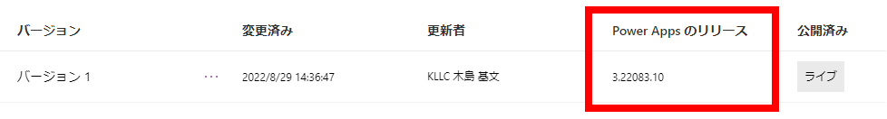
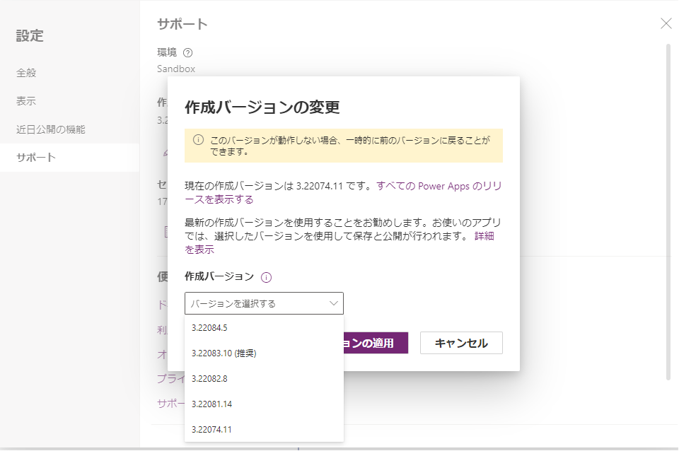
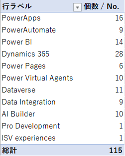

<!--　class: top -->

`Power Platform リリース計画`

---

<!-- class: slides -->

# 目次

この勉強会は、アーカス・ジャパン株式会社の 合同勉強会 を公開する形で実施しています。
こんなことやってます、こんなことやってみましたを、YouTube + Slido で紹介する勉強会です。 
今回の勉強会は、Power Platform の リリース計画 についてです。

- 今後のリリース計画の情報収集について
- 2022 リリース計画 Wave 2

---

# Power Platform の リリース計画

Power Platfrom のリリース計画はどこで確認していますか？

基本的にはここです。※英語のほうが情報が早いです。

リリースは、年２回に分けて計画されます。

（英語）[Dynamics 365 and Microsoft Power Platform release plans](https://docs.microsoft.com/en-us/dynamics365/release-plans/)

（日本語）[Dynamics 365 および Microsoft Power Platform のリリース計画](https://docs.microsoft.com/ja-jp/dynamics365/release-plans/)

キャンバスアプリはここのようです。

（英語）[Important upcoming changes (deprecations) in canvas apps](https://docs.microsoft.com/en-us/power-apps/maker/canvas-apps/important-changes-deprecations)
（日本語）[キャンバス アプリで予定されている重要な変更 (と非推奨)](https://docs.microsoft.com/ja-jp/power-apps/maker/canvas-apps/important-changes-deprecations)

---

# その他

もっと早い段階の情報は、Microsoft のイベントで確認できることがあります。

[Inspire](https://inspire.microsoft.com/ja-JP/home)
　 → 　１年に１回？　パートナー営業担当者が参加しているイメージ
[Ignite](https://ignite.microsoft.com/ja-JP/home)
　 → 　１年に１回？　企業内の IT 担当者とベンダーの開発者が参加してるイメージ
[Build](https://mybuild.microsoft.com/ja-JP/home)
　 → 　１年に１回？　プログラム開発者が参加するイメージ

---

# 二次情報

Microsoft イベントは長く分かりづらいということであれば、以下二次情報で情報を集めるのがよいかと思います。

[吉田さんのブログ](https://memo.tyoshida.me/)

[コンパスイベント１](https://powerapps.connpass.com/)

[コンパスイベント２](https://westpowerapps.connpass.com/)

→ 　ただ全部は説明しきれないのと、情報の正確性は保証されないです。
　　ではどうするか。

---

# 影響調査

1.  一覧表を作る
1.  担当システムに関係があるかないか、ざっくり印をつける
1.  印のないものについて、関係者内でレビューする
1.  早期アクセス環境を作成する 👉[参考](https://admin.powerplatform.microsoft.com/environments/environment/461d1129-9783-4da8-a2be-8f44b63f5783/hub?geo=Jpn)
1.  早期アクセス環境で確認可能なものは確認する
1.  有効／無効化スイッチが存在するものは、オンオフの設定内容を決める 👉[参考](https://admin.powerplatform.microsoft.com/environments/19f76d4b-e7d0-4a74-931f-82c8bdb2a3af/settings/Features)
1.  不明なものは Microsoft サポートに内容を確認する

→ 　 20XX Release WaveXX の報告書を作成して、お客様に報告する。
　　震えて当日を待つ。

---

# キャンバスアプリに関する注意事項

- 絶えずプラットフォームがアップデートされる
- 動作環境は、アプリの「詳細」から PowerApps のリリースバージョンを確認可能
  

- 保存して発行したタイミングで、リリースバージョンが変更される
- リリースバージョンを指定した開発が可能だけど、バージョンは限られた範囲（次ページ）

---

<!-- class: eof -->

---

<!-- class: slides -->

# 2022 リリース計画 Wave 2

2022 Wave 2 をざっくり分類してみました。

注目すべきアップデートは・・ Power Pages

[Power Pages 参考資料](https://docs.microsoft.com/ja-jp/power-pages/)
[Power Pages Community](https://powerusers.microsoft.com/t5/Microsoft-Power-Pages-Community/ct-p/MPPCommunity)

---

# 所感

実は、アップデートを確認する作業は難しいです。

- 機械翻訳なので何が書いてあるかわかりにくい。
- 英語で読んでも、肝心なことが書いて無いっぽい。
- 大した変更でもないのに、誇張された表現のことがある。
- 早期アクセス環境へのリリースは、たびたび遅れる。またはリリースされない。

⇒ サポートに聞いてもわからないこともありますが・・、親切に教えてくれるので、
　個別にサポートに聞くのがよいです。

---

<!--
class: eof
paginate: false
footer: https://kllc.github.io/blog/ © 2022 KLLC
-->

## Ｋ合同会社
