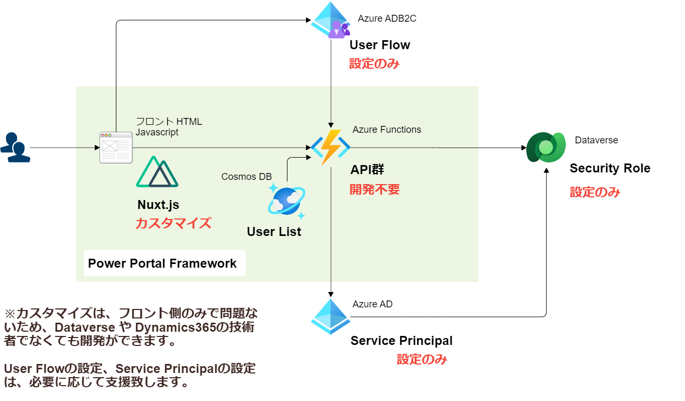

<!--　class: top -->
<script src="https://ajax.googleapis.com/ajax/libs/jquery/1.8.3/jquery.min.js"></script>
<script type="text/javascript">
$(function(){
$('a').attr({'target':'_blank'}); 
window.location.hash = '1';
});
</script>

<span style="font-size:2.2em;margin-left:10px;color:#333">Power Pages 勉強会</span>


---

<!-- class: slides -->

# 目次

この勉強会は、アーカス・ジャパン株式会社の 社外合同勉強会 を公開する形で実施しています。
こんなことやってます、こんなこと調べましたを紹介する勉強会です。<br>

今回の勉強会は、2022/10/12 に正式リリースされた、Power Pages についてです。<br>

- Power Pages とは 　(アーカス・ジャパン株式会社 沼上)
- Power Pages を使わないポータル開発フレームワーク　(Ｋ合同会社 木島 twitter:@kllcjp)

当日の勉強会の動画
👉 [Youtube](https://youtu.be/hj4JHipKEas)

---

# Power Pages を使って開発を行うのはいつ？誰？

- エンジニアじゃない人が開発、運営行うとき

- Dataverse のデータを使いたいとき
  [Dataverse とは](https://www.arcuss-japan.com/products/msds)

- 取引先企業アクセス、取引先担当者アクセスを使うとき

  → 　販売代理店サイトなどを作るときにものすごい便利です

👉 　企業の情報システム担当が、社外向けのアプリを作れるというサービスかと思います。

---

# Power Pages での開発の難しさ

- 大規模開発には向いていない

- ブラウザでの開発の操作が鈍く、サクサク開発できない

- フォームとビュー部分はカスタマイズできない

あと、Power Pages で開発する人は、この記事は読んでおいてください。

https://qiita.com/infoshare/items/6ddaafec7660de15d936

---

# Power Pages ではなくスクラッチ開発を考えてみる

- プログラミング言語は英語より簡単

👉 　 Power Pages はコーディング不要ということですが、昨今はコーディングもそんなに難しくない

- デザインも割りと簡単

👉 　 CSS フレームワークとかテンプレートを参考にすれば、割と簡単にデザインできる

- 大規模な開発ができる

---

<!-- class: image -->

# Power Portal Framework のアーキテクチャ



---

<!-- class: slides -->

# 一覧を表示する場合

```　javascript
const req1 = {
  collection: "contacts",
  select: [
    "contactid",
    "lastname",
    "firstname",
    "emailaddress1",
  ],
};
getList(req1,grid)

```

---

# レコードを表示する場合

```　javascript
  let req2 = {
    key: row.cell(0).data.toString(),// GUIDを設定
    collection: "contacts",
    select: [
      "contactid",
      "lastname",
      "firstname",
      "emailaddress1",
    ],
  };
  data.record = await getRecord(req2);
```

---

# データを更新する場合

```　javascript
  let req3 = {
    key: data.record.contactid,// GUIDを設定
    collection: "contacts",
    entity: data.record,
  };
  await saveRecord(req3);
```

---

<!-- class: slides -->

# Power Portal Framework

Power Pages を使わないポータル開発フレームワーク 「Power Portal Framework」 は、
以下の特徴があります。

- Power Pages を使わないため、デザインの制約など、Power Pages 固有の問題はありません！

- 殆どの作業は通常の Nuxt.js のフロントエンド開発であり、Github で共同開発、ローカル環境でテストなど、大規模開発時にも効率的に開発が行なえます！

---

<!--
class: eof
paginate: false
footer: © 2021 KLLC
-->

## Ｋ合同会社
