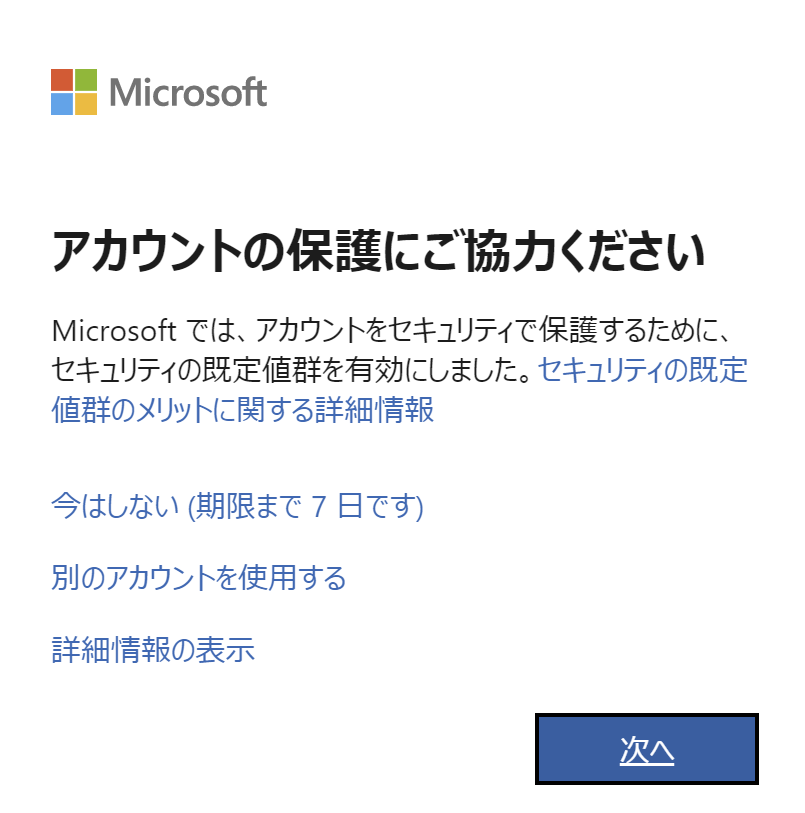
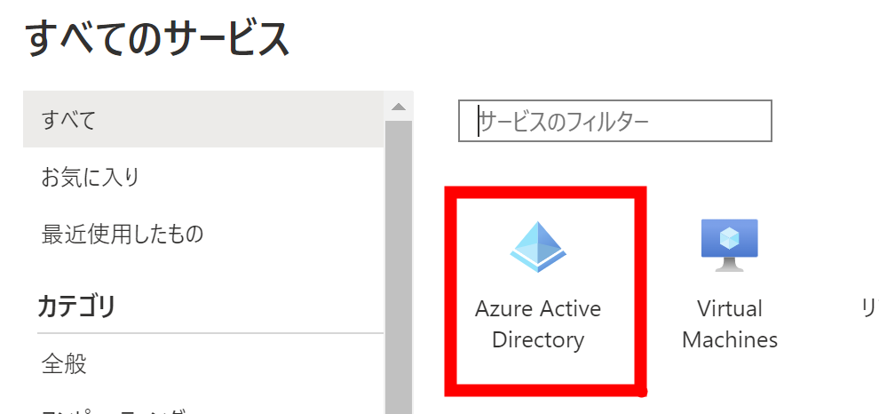
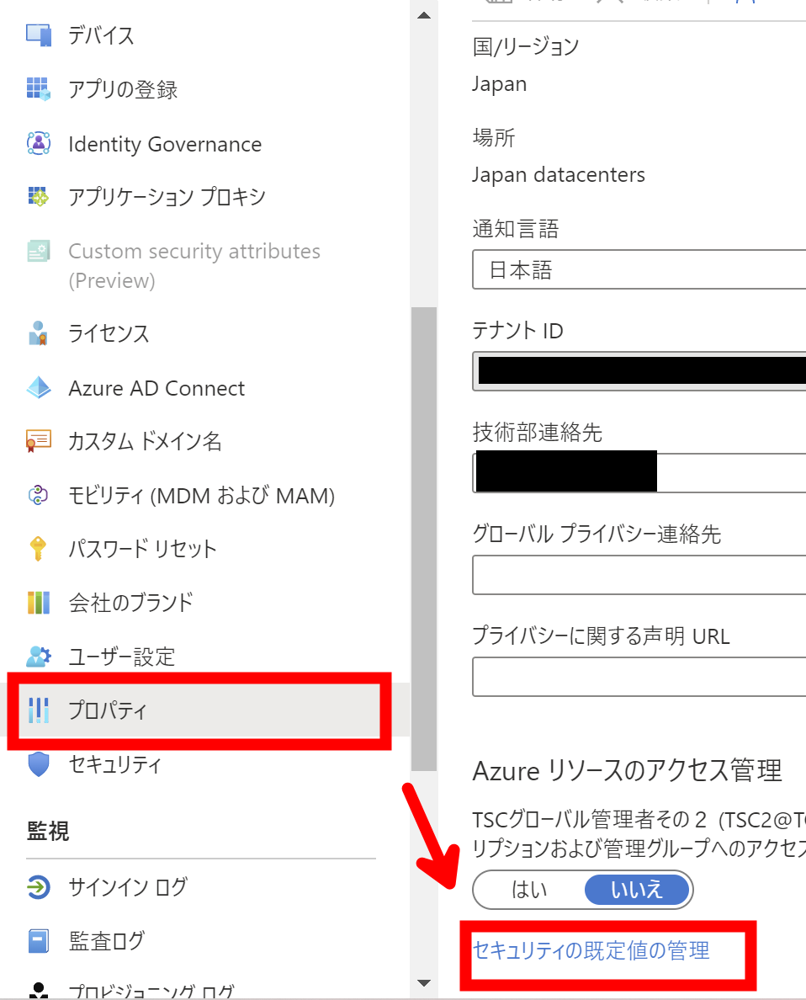

# 二段階認証の回避は絶対やってはいけない

全体管理者は、二段階認証は必ず設定すべきです。  
試用版であったとしても、クレジットカードを登録しているので非常に危ないということを認識しておいてください。

## 本当にあった怖い話

実話なのですが、以下のような簡単なテナント名で、  
test20221208.onmicrosoft.com

簡単なユーザー名  
admin@test20221208.onmicrosoft.com

簡単なパスワード  
p@ssw0rd

とかに設定してしまっていると・・  
推測されて不正にログインされて、Azure 上に超高額な仮想マシンを作られ、マイニングに使われる。

早めに気づいて高額な請求について問い合わせていても、結局引き落としが行われることになります。  
くどいようですが、実話です。

```
本件に関する内容について、現在引き続き複数の関連部門にて調査を進めている状況でございます。
しかしながら、現時点で明確な内容の確認までには至っておりません。

また、2021 年 7 月 6 日 に今回のご請求金額の [1,747,657 円] のお支払いが、完了していることをシステム上確認いたしました。
上記内容を含めて、可能な限り迅速に対応をおこなってまいります。

お忙しいところ恐縮ですが、調査完了まで今しばらくお待ちいただけますようお願い申し上げます。
```

# 二段階認証の回避をすると

二段階認証の回避をするとこのメッセージが出なくなります。  
出ないほうが便利なので、どうしてもやりたくなりますよね。



# 二段階認証を回避する方法

絶対やってはいけないのですが、やる方法は以下です。

Azure Portal にログインして  
Azure Active Directory 　を選択



プロパティ　＞　セキュリティ既定値の管理



セキュリティ既定値の有効化 を　「いいえ」　に変更


# 本来どうすべきか

- 試用版であったとしても、必ず、全体管理者は２段階認証を有効にする。
- 全体管理者を複数作るのは問題ないので、ぜったいに ID は共有しない。
- できれば、全体管理者のユーザー名も admin など簡単にしない。
- 全体管理者ではないユーザーを作る。
  そちらに、Office365 や、Dynamics 365 のライセンスをつけて、利用する。
- 全体管理者ではないユーザーに、Dynamics 365 のシステム管理者ロールをつけもてもちろん問題ない。
