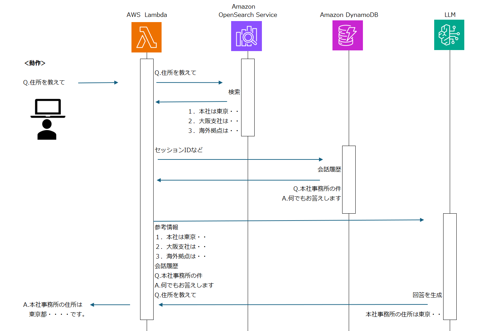

<!-- class: top -->

アーキテクチャ検討・報告

---

<!-- class: slide -->

# RAG おさらい

[RAG | 用語解説](https://www.nri.com/jp/knowledge/glossary/lst/alphabet/rag)

 
Bedrockは、アプリケーション／外部情報／大規模言語モデルをすべてをカバーしている。

---

# LLM おさらい

言語モデル（LLM）は、インターネットから収集した大量のテキストデータに含まれる単語・フレーズの出現パターンを学習し、その情報をもとに特定の言葉の後ろに確率的に続きそうな言葉を並べて文章を生成している。

- 初期の API を利用した例
  「日本の人口を教えて」　 → 　「ください。日本の人口は 1 億 2000 万人です。」
  ※命令形には　ください　がつくことが確率的に多い。

- Chat に特化した API が提供されることで、より自然な会話が可能になった。
  「日本の人口を教えて」　 → 　「日本の人口は 1 億 2000 万人です。」

最新の情報や非公開情報は回答できない。また、確率の高い言葉を選択するため、不適切な回答をすることがある。

- 「採用情報を教えて」　 → 　「こちらの URL をご覧ください。http://XXX.com/recruit」
  ※存在しない URL であるが、多くの会社は recruit という単語を含む URL で採用情報を提供しているため。

ステートレスな API であるため、会話の流れを保持することはできない。
毎回、会話の全文を送信する必要がある。

👉️ 　 Chat として利用するには、情報を補完する仕組みが必要。

---

# 単純な RAG

