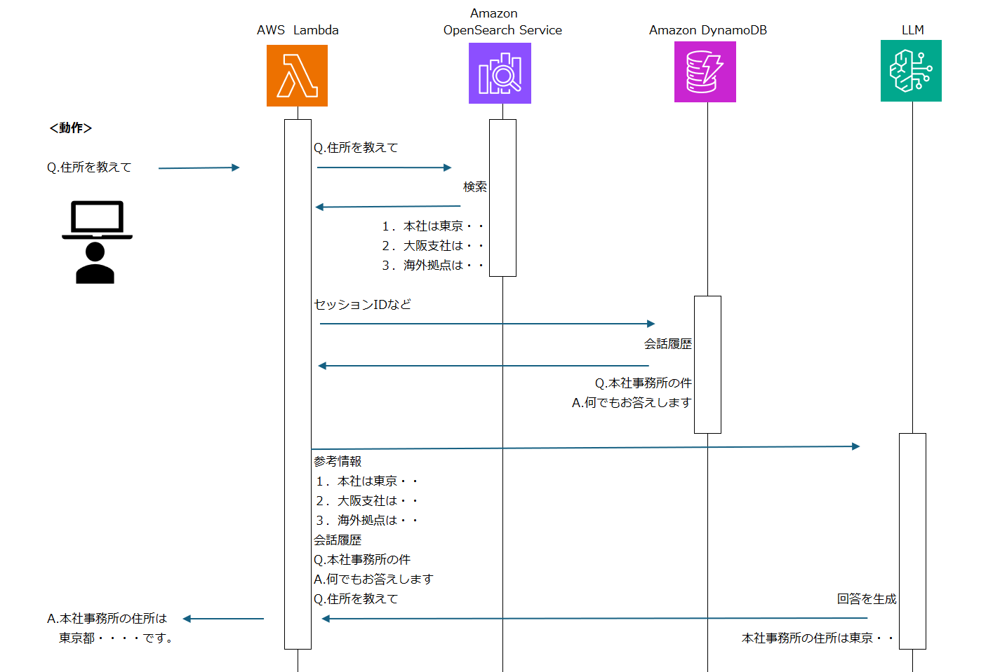

<!-- class: top -->

アーキテクチャ検討・報告

---

<!-- class: slide -->

# 今日話すこと

1. 自己紹介
1. RAG おさらい
1. RAG のコンポーネント
1. RAG の精度向上のための技術

- 評価
  　コスト
  　スピード

- データセットの整形
  　　チャンクのサイズ、チャンクの重複
  　ドキュメントインテリジェンス
  web の場合の meta タグや js などの削除
  　要約
  　要約の並列化
  ベクトル検索
  　課題　犬ではないペット
  　　事前に回答を生成してから検索

特にマニアックな単語に対して､ベクトル計算の精度が低いという点です｡
二つ目は､クエリ文字列と文献の中身が､質的に異なるという点です｡

評価が悪い時は検索結果を使わない
検索結果の正しさを LLM で評価する

- モデルの調整
- 検索方法
- プロンプト
  　タブで構造化など

ヒアリングに特化する

- 事例

- まとめ

---

勉強会アジェンダ: RAG（Retrieval-Augmented Generation）の精度向上の様々な方法

1. 導入 (10 分)
   RAG とは何か？その基本的な概念と動作原理の簡単な説明。
   本日のアジェンダの紹介。
2. RAG システムの構成要素とその役割 (20 分)
   データソース: 使用されるデータの種類とその選定基準。
   リトリバルコンポーネント: 情報検索の技術と使用されるアルゴリズム。
   ジェネレータコンポーネント: テキスト生成における技術とモデル。
3. 精度向上のための主要な技術と戦略 (30 分)
   クエリの最適化: より効果的な検索結果を得るためのクエリ改良方法。
   フィードバックループ: ユーザーフィードバックを取り入れた学習プロセス。
   データセットの拡張: 多様なデータを使用したモデルの一般化能力の向上。
4. 実際の事例とアプリケーション (20 分)
   事例研究: 成功事例とその実装の詳細。
   RAG を活用した具体的なアプリケーションの紹介。
5. ツールとリソース (15 分)
   開発に役立つツールとライブラリの紹介。
   学習と実験におすすめのリソース。
6. 質疑応答 (15 分)
   参加者からの質問に答える。
7. まとめと次回の勉強会に向けて (10 分)
   本日のセッションの要点の再確認。
   次回の勉強会のテーマの提案と日程の確認。

---

# RAG おさらい

[RAG | 用語解説](https://www.nri.com/jp/knowledge/glossary/lst/alphabet/rag)

 
Bedrockは、アプリケーション／外部情報／大規模言語モデルをすべてをカバーしている。

---

# LLM おさらい

言語モデル（LLM）は、インターネットから収集した大量のテキストデータに含まれる単語・フレーズの出現パターンを学習し、その情報をもとに特定の言葉の後ろに確率的に続きそうな言葉を並べて文章を生成している。

- 初期の API を利用した例
  「日本の人口を教えて」　 → 　「ください。日本の人口は 1 億 2000 万人です。」
  ※命令形には　ください　がつくことが確率的に多い。

- Chat に特化した API が提供されることで、より自然な会話が可能になった。
  「日本の人口を教えて」　 → 　「日本の人口は 1 億 2000 万人です。」

最新の情報や非公開情報は回答できない。また、確率の高い言葉を選択するため、不適切な回答をすることがある。

- 「採用情報を教えて」　 → 　「こちらの URL をご覧ください。http://XXX.com/recruit」
  ※存在しない URL であるが、多くの会社は recruit という単語を含む URL で採用情報を提供しているため。

ステートレスな API であるため、会話の流れを保持することはできない。
毎回、会話の全文を送信する必要がある。

👉️ 　 Chat として利用するには、情報を補完する仕組みが必要。

---

# 単純な RAG

---

PDF

- Document インテリジェンス
- マークダウンにする
