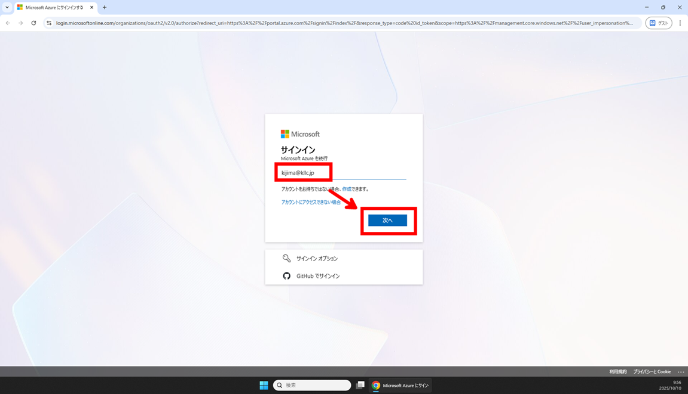
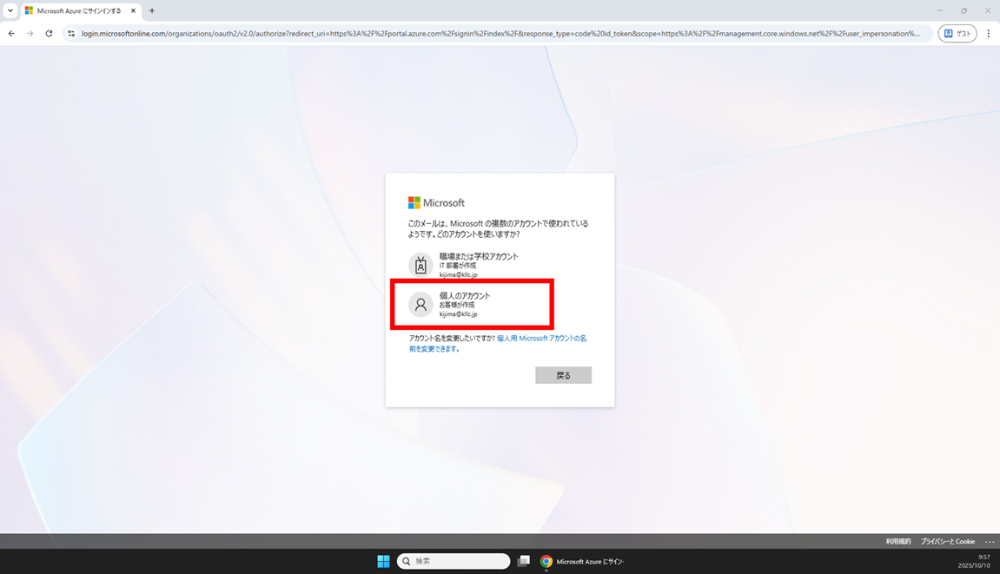
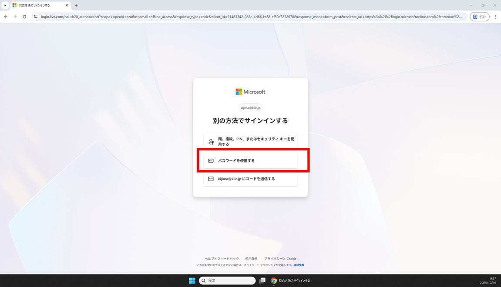
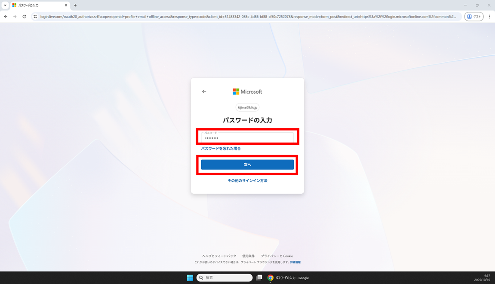
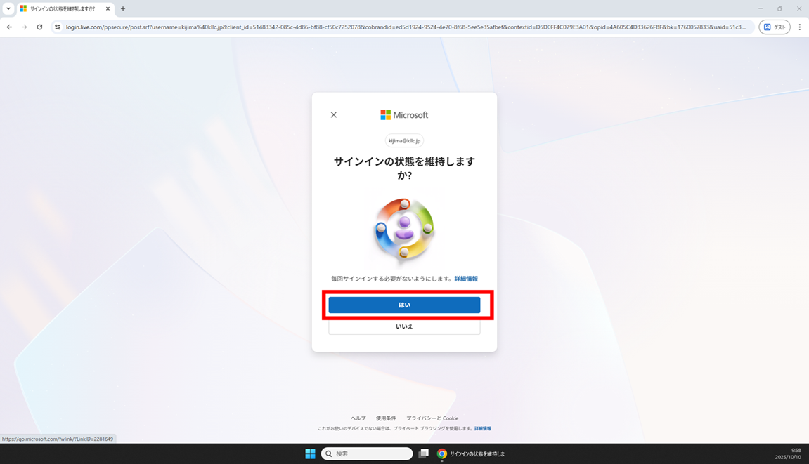
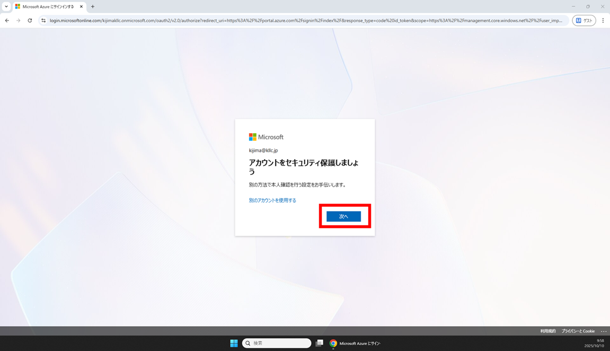
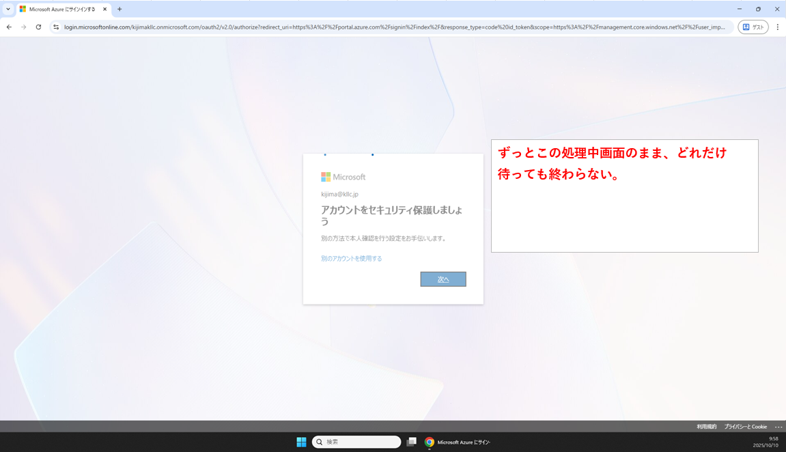

# 事象

Azure に一生ログインできない事象。

# 原因と思われること

Azure Portal で多要素認証が必須化されて、多要素認証の登録がない ID の場合に多要素認証の登録画面に遷移しようとしているけど、個人用アカウント（Microsoft アカウント）の場合に組織アカウントの認証設定にリダイレクトしようとして詰んでいる。（と思われる。）

- 組織アカウントの認証設定はここ  
  https://mysignins.microsoft.com/security-info

- 個人アカウントの認証設定はここ  
  https://account.microsoft.com/security

# 解決策

個人アカウントの認証設定画面で、多要素認証を登録したらログインできた！  
と思っていましたが・・、気のせいだったのかまたログインできなくなってました。  
まだ未解決です。

# 備考

このテナントは個人アカウントでつくった検証用のリソースがあるだけなので、とりあえず、Microsoft のバグが直るのを待つようにします。  
Azure の サポートは有料なのですが、Standard プラン 100 ドル/月 払うと解決する可能性がありそうです。
